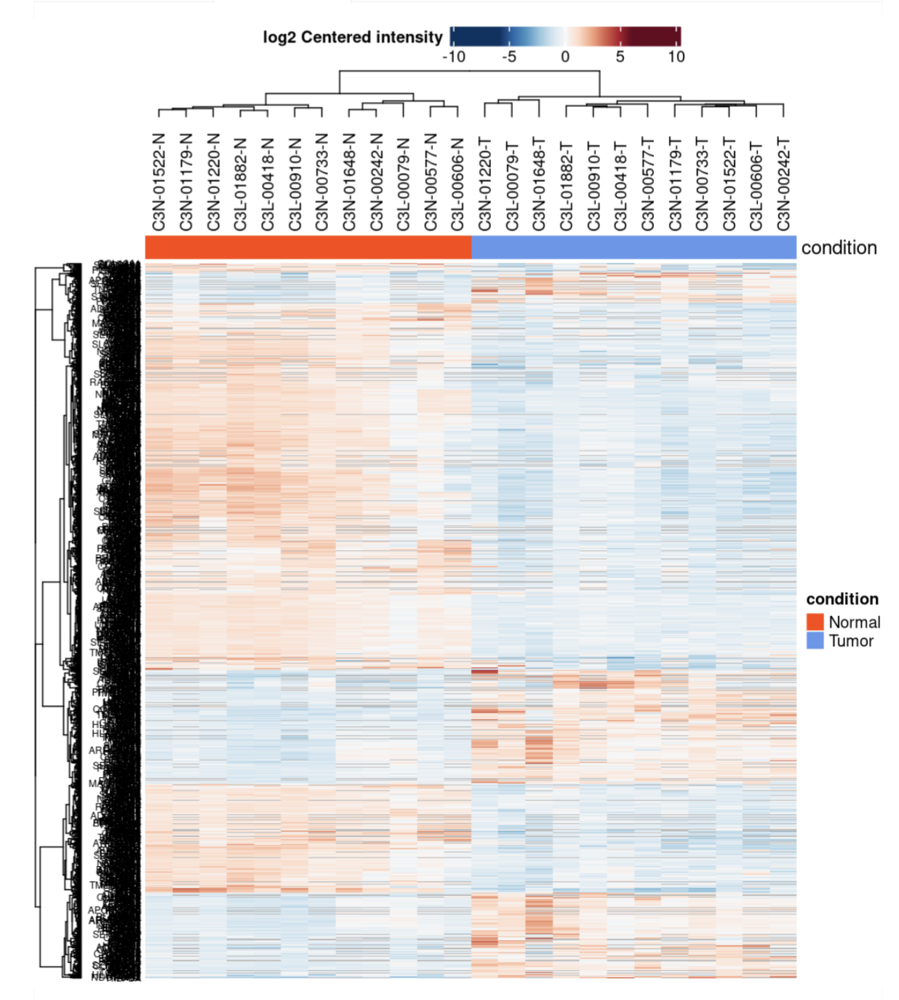
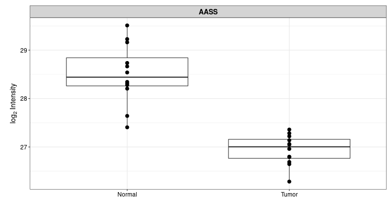
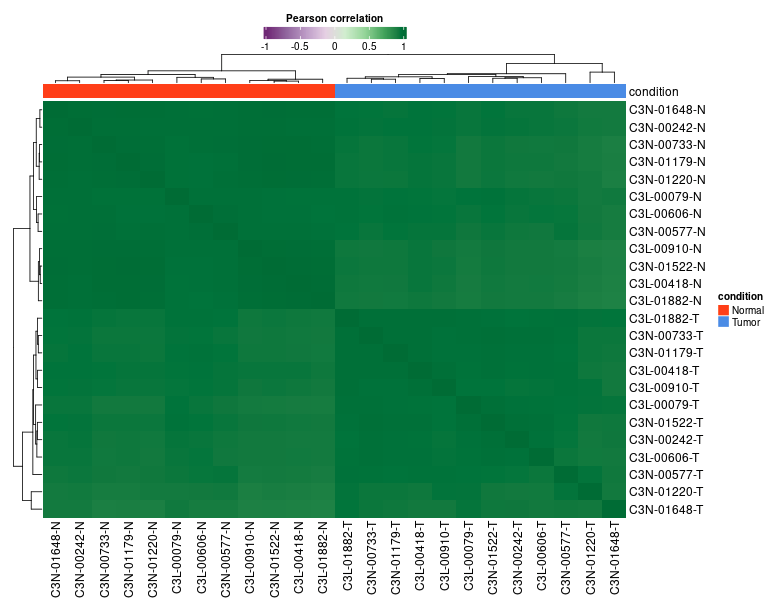
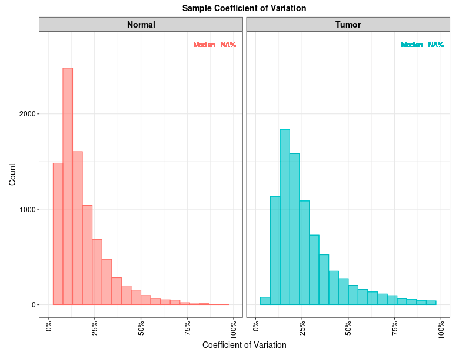
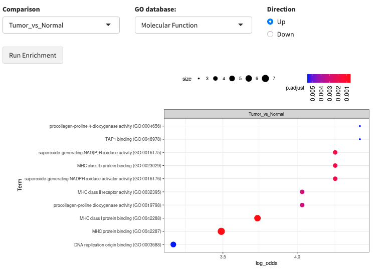
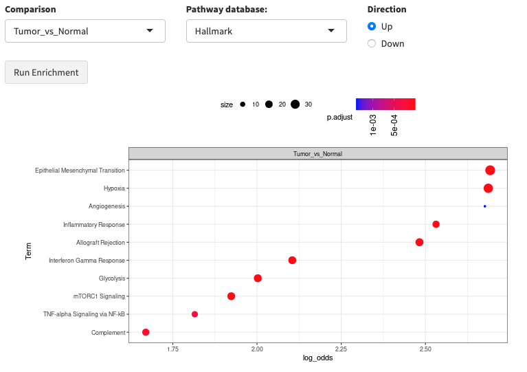

FragPipe-Analyst for TMT data
===========================================================

# Introduction
------------

The **TMT** module in FragPipe-Analyst to automate downstream statistical analysis of quantitative proteomics results generated by the TMT workflow of FragPipe.

# Input
-----
-  **[abundance/ratio]\_gene_[normalization choice].tsv** generated by *TMT-Integrator* in *FragPipe*.

    The sample data file contains 3 out of the total 23 TMT plexes as a subset of data in abundance_gene_MD.tsv *TMT-Integrator* report. Original data can be found in the CPTAC clear cell Renal Cell Carcinoma (ccRCC) discovery project:
[Integrated Proteogenomic Characterization of Clear Cell Renal Cell Carcinoma, Cell (2019)](https://www.sciencedirect.com/science/article/pii/S0092867419311237?via%3Dihub)

- **combined_annotation.tsv** file automatically generated by *FragPipe*.
    -  If there are replicates in the column names of the report (samples), make sure to label their occcurence in the `replicate` column of the annotation file. The last column `condition` is to be specificed by user indicating the comparison of interest.

    The following table shows the first 3 rows in the sample combined_annotation.tsv file. The goal of the analysis is to compare protein expression between Tumor and Normal. 
    experiment | channel      | label         | plex         | replicate | condition
    ----------|------------ | ------------- | -------------| ----------| ----------
    16CPTAC_CCRCC_W_JHU_20171007|126| C3N-01179-T   |16 | 1 |Tumor
    16CPTAC_CCRCC_W_JHU_20171007|127N| C3N-00606-T   |16| 1|Tumor
   16CPTAC_CCRCC_W_JHU_20171007 |127C| C3N-01179-N   |16| 1| Normal

  
## Advanced Options
----------------

### Significant protein filtering criteria

-   Adjusted p-value cutoff: default is **0.05**
-   Log2 fold change cutoff: default is **0.7**

### Missing value imputation options

-   **No imputation:** This is the default setting.
-   **Perseus-type:** This method is based on popular missing value
    imputation procedure implemented in *Perseus*. The missing values are replaced by random numbers drawn from a normal distribution of *1.8* standard deviation down shift and with a
    width of *0.3* of each sample.
-   **MLE:** Maximum likelihood-based imputation method using EM algorithm. 
-   **knn:** Missing values replace by nearest neighbor averaging technique
-   **min:** Replaces the missing values by the smallest non-missing value in the data.
-   **zero:** Replaces the missing values by **0**.

### False Discovery Rate (FDR) correction option

-   Benjamin Hochberg (BH) method
-   local and tail area based: Implemented in [fdrtools](https://strimmerlab.github.io/software/fdrtool/index.html)

In sample data demonstration, we set Adjusted p-value cutoff at **0.05**, Log2 fold change cutoff at **1** and Type of FDR correction at **Benjamini Hochberg**. 

### Differential expression analysis (DE)

# Output
------

We use a *Bioconductor* package *limma* to carry out the DE analysis on each protein. Contrasts are built automatically from condition levels provided by the user allowing the generation of results for all possible comparisons. Multiple test adjustment are done with user specified options (default with "BH"). It also takes into account user defined cutoffs to filter significantly differentially expressed proteins.

## Result table

1.  **Results Table:** Includes names (Gene names), Protein Ids, Log
    fold changes/ ratios (each pairwise comparisons), Adjusted
    *p-values* (applying FDR corrections), *p-values*, Boolean values
    for significance, average protein intensity (log transformed) in
    each sample.

## Result Plots

1.  **Volcano plot**: A volcano plot is generated for each pairwise
    comparison. It is a graphical visualization by plotting the “Fold
    Change (Log2)” on the x-axis versus the –log10 of the “ *p-value*”
    on the y-axis. Interesting candidate proteins are located in the
    left and right upper quadrant. User can toggle the display name
    checkbox to highlight names of differentially expressed proteins or
    use 'adjusted *p-value*' as y-axis. Importantly, user can highlight
    protein or their interest (colored maroon) by selecting the row from
    "**Results Table**". This highlighted plot can be downloaded
    using " *Save Highlighted Plot*" button.

2.  **Heatmap**: The heatmap representation gives an overview of all
    significant/differentially expressed proteins (rows) in all samples (columns). This visualization allows the identification of general trends such as if one sample or replicate is highly different compared to the others and might be considered as an outlier. Additionally, the hierarchical clustering of samples (columns) indicates how related the different samples are and hierarchical clustering of proteins (rows) identifies similarly behaving proteins.
    
    With our sample data, the heatmap shows expected separation between tumor and nomral samples and a few protein clusters behaving contrastingly different between the groups. User also have option to download protein information from individual cluster.

1. **Protein plot**: Selecting a gene from the 'Results Table', A box plot or a violin plot will be shown comparing expression of that gene between conditions. 

## QC plots
1. **PCA plot**: A Principal Component Analysis(PCA) is a technique
    used to emphasize variation and bring out strong patterns in a
    dataset. PC1, which is a linear combination of all features, shown on the x axis,  explains the most variation of the data, and followed by the rest of PCs. In brief, the more similar 2 samples are, the closer they cluster together. For further information, here are a few links, which explains the principals of PCAs: [Info](ttp://ordination.okstate.edu/PCA.htm) and [Basic
    introduction](http://setosa.io/ev/principal-component-analysis/)

    After PCA analysis with our sample data, samples are presented in the scatter plot below. Tumor and Normal samples are well separated by PC1 values. 
    

2. **Sample Correlation Plot**: A correlation matrix is plotted as a
    heatmap to visualize the Pearson correlation coefficients between
    the different samples.

3. **Sample CVs Plots**: *screenshot pending*  A plot representing distribution of protein level coefficient of variation for each condition. Each plot also contains a vertical line representing median CVs percentage within that condition. 
4. **Protein Numbers**: A bar-plot representing number of proteins
    identified and quantified in each TMT plex.

5. **Missing values- Heatmap**: To explore the pattern of missing
    values in the data, a heatmap is plotted indicating whether values
    are missing (0) or not (1). Only proteins with at least one missing
    value are visualized. 

## Enrichment

1. **Gene Ontology**: Selecting the comparison of interest, the GO database (Molecular Function/Cellular Component/Biological Process), and direction (up regulated or down regulated). It checks the differentially expressed (DE) list of genes against known sets of genes. The background gene list is composed with IDs appeared in the input data. A hypergeometric test is performed. Log odds ratio (log_odds) is calculated as `log2((IN/OUT)/(bg_IN/bg_OUT))`, where IN and OUT are the number of DE genes in and outside of a gene set of interest, and bg_IN and bg_OUT are the nubmer of other genes in and outside of a gene set of interest. Gene sets used are fetched from the [Enrichr](https://maayanlab.cloud/Enrichr/) API

1. **Pathway enrichment**: Same algorithm is used as the Gene Ontology part. Pathway database choices are Hallmark, KEGG and Reactome. 

## Download options

-   **Download tables** (csv format)

1.  Results: Same as *Results Table*
2.  Unimputed data matrix: Original protein intensities before
    imputation in each sample.
3.  Imputed data matrix: Protein intensities after performing selected
    imputation method
4.  Full results: Combined table of all above data outputs i.e. with and
    without imputation information, along with fold change and p-values.

-   **Download Report** (word format) A summary report document
    including some statistics and plots.

-   **Download Plots** (PDF format) A PDF document containing all the
    plots generated during the analysis.