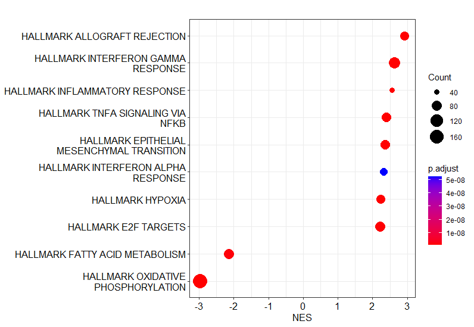

# Advanced Usage

## How to run GSEA (gene set enrichment analysis) based on result of FragPipe-Analyst?
(contributed by Quinn J Mattison, quinn-mattison@uiowa.edu)

Here we will continue our TMT tutorial

- Download the DE result (a sample file is available [here](TMT-tutorial/Results.csv))
- Make sure you have R packages required to run the script (`clusterProfiler`, `msigdbr`, `enrichplot`)
- Write a script similar to the following one
``` R
library(clusterProfiler)
library(msigdbr)
library(enrichplot)

df <- read.csv("./Results.csv", header=TRUE)
gene_list <- df$Tumor_vs_Normal_log2.fold.change
names(gene_list) <- df$Gene.Name
gene_list <- na.omit(gene_list)
gene_list <- sort(gene_list, decreasing = TRUE)

# Get the hallmark gene set
H <- msigdbr(species = "Homo sapiens", category = "H")
H.select <- dplyr::select(H, gs_name, gene_symbol)

gsea_result <- GSEA(
  geneList = gene_list,
  exponent = 1,
  minGSSize = 10,
  maxGSSize = 500,
  eps = 1e-10,
  pvalueCutoff = 0.05,
  pAdjustMethod = "BH",
  TERM2GENE = H.select,
  TERM2NAME = NA,
  verbose = TRUE,
  seed = FALSE,
  by = "fgsea",
)

dotplot(gsea_result, x="NES", showCategory=10)
```

Now you should be able to get a dotplot which is similar to Figure 4B of the previous [CPTAC ccRCC study](https://www.sciencedirect.com/science/article/pii/S0092867419311237).




